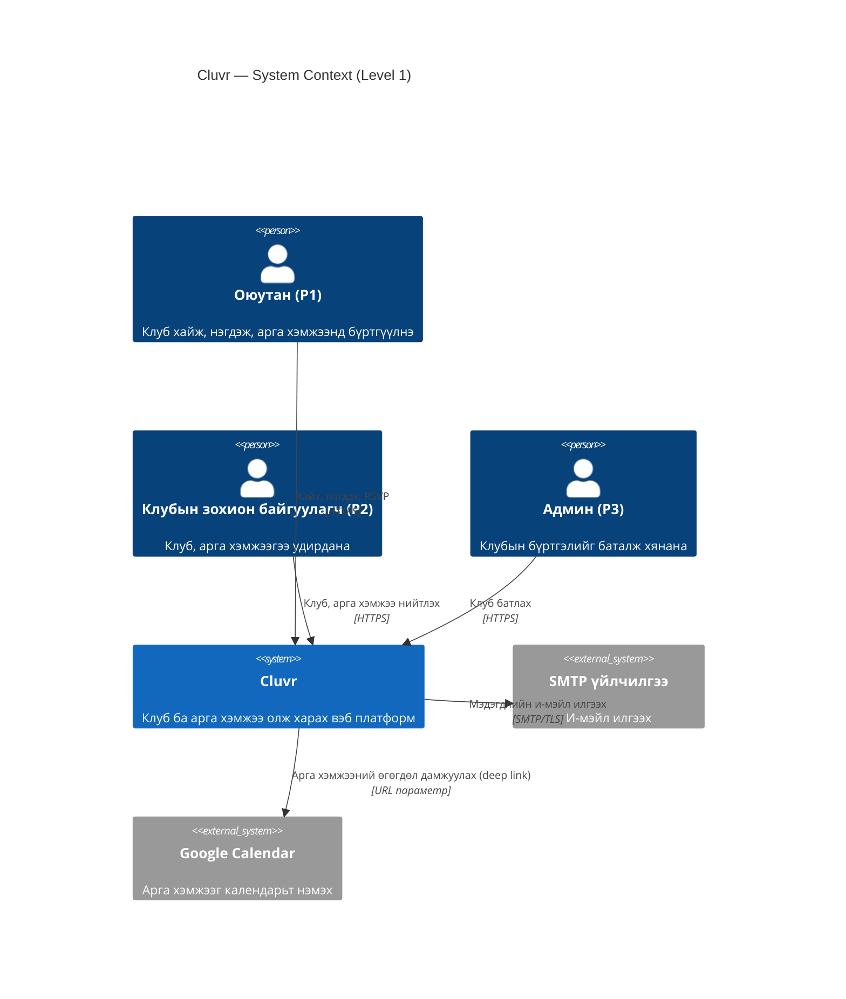
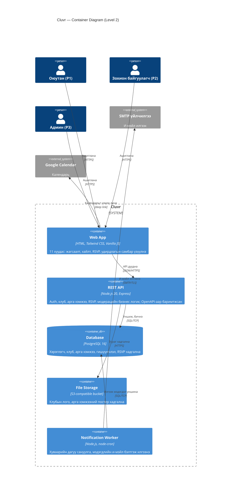
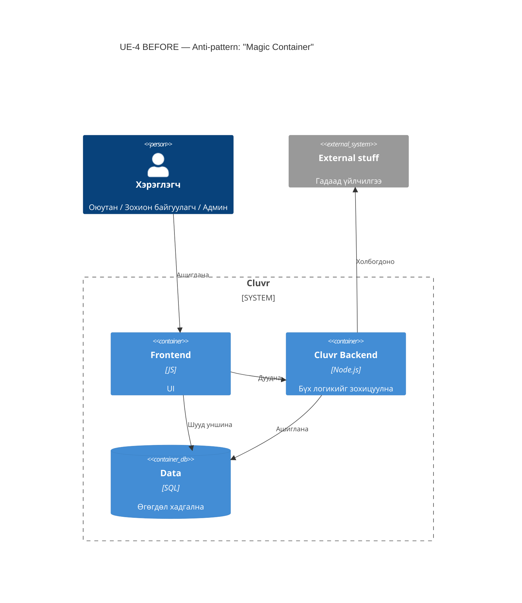

# Cluvr — Architecture Documentation (Week 04)

SW Project Documentation · National University of Mongolia · Sprint M4 · 2026-08-30

**Агуулга:** 1) arc42 §1 · 2) arc42 §3 · 3) arc42 §5 + C4 Container · 4) ADR index ба ADR-0001…0003 · 5) UE-4 Before/After + ADR-0004 · 6) Эргэцүүлэл

**Definition of Done:** arc42 §1/§3/§5 ✔ · C4 Context & Container (Mermaid) ✔ · 3 ADR (MADR) ✔ · Traceability FR 13/15 = 86.7 % ✔

---
## arc42 §1 — Зорилго ба шаардлага (Introduction and Goals)

> Төсөл: **Cluvr** — их сургуулийн клуб, арга хэмжээ олж харах платформ · Sprint M4 · v1.0

### 1.1 Шаардлагын тойм
Cluvr нь оюутнуудад кампусын клубүүд болон арга хэмжээг нэг газраас хайж, нэгдэж, бүртгүүлэх; клубын зохион байгуулагчдад мэдээлэл түгээх, гишүүд болон бүртгэлээ удирдах боломж олгоно. Бүрэн шаардлага нь SRS v1.0 (15 FR + 5 NFR)-д байна.

| Гол зорилго | Холбогдох SRS ID |
|---|---|
| Клуб хайх, шүүх, танилцах | FR-02, FR-03, FR-04 |
| Клубт нэгдэх, арга хэмжээнд бүртгүүлэх | FR-05, FR-08 |
| Арга хэмжээ, клубын мэдээлэл нийтлэх | FR-09, FR-10, FR-15 |
| Мэдэгдэл, сануулга | FR-12 |
| Модерац, хяналт | FR-14 |

### 1.2 Чанарын зорилтууд (Top 3)
| # | Чанар | Сценари | SRS |
|---|---|---|---|
| 1 | Хэрэглэхэд хялбар | Шинэ оюутан ≤ 3 товшилтоор клубын хуудсанд хүрнэ | NFR-03 |
| 2 | Хурд | Үндсэн хуудас 1280px дэлгэц дээр ≤ 2 сек-д ачаалагдана | NFR-01 |
| 3 | Засвар, ойлгомжтой байдал | Шинэ хөгжүүлэгч README + ADR-аар 1 өдөрт орчноо босгоно | NFR-05 |

### 1.3 Оролцогч талууд (Stakeholders)
| Оролцогч | Persona (Week 1) | Хүлээлт |
|---|---|---|
| Оюутан | P1 — Шинэ оюутан | Клуб, арга хэмжээг нэг дороос олох |
| Клубын зохион байгуулагч | P2 — Клубын ахлагч | Мэдээллээ хурдан түгээх, бүртгэл авах |
| Админ (Оюутны хөгжлийн алба) | P3 — Админ | Клубын жагсаалтад хяналт тавих |
| Хөгжүүлэгч (Saruula) | — | Ойлгомжтой, дахин ашиглахаар баримтжуулсан код |
| Багш | — | Баримтжуулалтын стандартад нийцсэн эцсийн бүтээгдэхүүн |

### 1.4 Persona-ийн зовиур (ADR-д буцаж холбогдох)
| ID | Persona | Зовиур |
|---|---|---|
| PP-1 | P1 | Клубийн мэдээлэл Facebook, чат дунд тархсан тул хайхад удаан |
| PP-2 | P2 | Зарлал алга болдог, бүртгэлийг гараар (Google Form) цуглуулдаг |
| PP-3 | P3 | Идэвхгүй/давхардсан клубийг хянах арга байхгүй |
| PP-4 | P1, P2 | Сайт удаан, ойлгомжгүй бүтэцтэй бол хэрэглэхээ болино |

> ⚠️ Persona болон PP-ийн нэр, агуулгыг өөрийн Week 1 баримттай тулгаж засаарай.

---
## arc42 §3 — Хүрээ ба контекст (Context and Scope)

Диаграм: `diagrams/c4-context.mmd` (Mermaid, Diagram-as-Code)

### 3.1 Бизнесийн контекст
| Гадаад тал | Төрөл | Persona | Cluvr рүү | Cluvr-аас |
|---|---|---|---|---|
| Оюутан | Хүн (actor) | P1 | Хайлт, нэгдэх хүсэлт, RSVP | Клуб/арга хэмжээний жагсаалт, мэдэгдэл |
| Клубын зохион байгуулагч | Хүн (actor) | P2 | Клуб/арга хэмжээ үүсгэх, зураг | Гишүүн, RSVP-ийн жагсаалт |
| Админ | Хүн (actor) | P3 | Клуб батлах/цуцлах шийдвэр | Батлах хүлээлтийн жагсаалт |
| SMTP үйлчилгээ | Гадаад систем | — | — | Хүлээн авагч, сэдэв, агуулга → Хүргэлтийн төлөв |
| Google Calendar | Гадаад систем | P1 | — | Арга хэмжээний огноо, гарчиг, байршил (deep link) |

Гадаад талуудын тоо: 3 actor (≥3 ✔), 2 neighboring system (≥2 ✔).

### 3.2 Техникийн контекст
| Интерфейс | Протокол | Өгөгдлийн урсгал |
|---|---|---|
| Хэрэглэгч ↔ Cluvr | HTTPS (браузер) | HTML/JS, JSON |
| Cluvr → SMTP | SMTP over TLS | Хүлээн авагч, сэдэв, агуулга |
| Cluvr → Google Calendar | HTTPS deep link (`calendar.google.com/calendar/render?...`) | Арга хэмжээний нэр, цаг, байршил |

### 3.3 Хамрах хүрээнээс гадуур
Төлбөр, чат, мобайл апп, олон сургуулийн дэмжлэг (Week 5+ backlog).

### 3.4 Контекст диаграм

---
## arc42 §5 — Building Block View

Диаграм: `diagrams/c4-container.mmd`

### 5.1 Түвшин 1 — Whitebox: Cluvr (5 container, ≤ 8 ✔)
| Блок | Технологи | Хариуцлага | Хангах SRS ID |
|---|---|---|---|
| **Web App** | HTML, Tailwind CSS, Vanilla JS | 11 хуудсын UI, API client, form шалгалт | FR-01…FR-10, FR-14, NFR-01, NFR-03 |
| **REST API** | Node.js 20, Express | Бизнес логик, эрхийн шалгалт, OpenAPI | FR-01…FR-10, FR-14, FR-15, NFR-02 |
| **Database** | PostgreSQL 16 | Өгөгдлийн хадгалалт, индекс | FR-02…FR-10, NFR-01 |
| **File Storage** | S3-compatible bucket | Лого, постер | FR-15 |
| **Notification Worker** | Node.js, node-cron | Сануулга, и-мэйл | FR-12 |

### 5.2 Түвшин 2 — Whitebox: REST API (модулиуд)
| Модуль | Хариуцлага | SRS ID |
|---|---|---|
| Auth | Бүртгэл, нэвтрэлт, session/JWT, эрх (student/organizer/admin) | FR-01, NFR-02 |
| Club | Клубын CRUD, хайлт, шүүлт | FR-02, FR-03, FR-04, FR-09 |
| Event | Арга хэмжээний CRUD, календарь | FR-06, FR-07, FR-10 |
| Membership & RSVP | Клубт нэгдэх, арга хэмжээнд бүртгүүлэх | FR-05, FR-08 |
| Moderation | Клуб батлах/цуцлах | FR-14 |
| Media | Зураг upload, хэмжээ шалгах | FR-15 |
| Notification (producer) | Мэдэгдлийн мөр DB-д үүсгэх | FR-12 (Worker-тэй хамт) |

### 5.3 SRS Traceability Matrix
| SRS ID | Шаардлага (товч) | Блок / модуль | Төлөв |
|---|---|---|---|
| FR-01 | Бүртгэл / нэвтрэлт | Web App, API·Auth | ✔ |
| FR-02 | Клубын жагсаалт үзэх | Web App, API·Club, DB | ✔ |
| FR-03 | Клуб хайх/шүүх | API·Club, DB | ✔ |
| FR-04 | Клубын хуудас | Web App, API·Club | ✔ |
| FR-05 | Клубт нэгдэх | API·Membership | ✔ |
| FR-06 | Арга хэмжээний жагсаалт | Web App, API·Event | ✔ |
| FR-07 | Арга хэмжээний дэлгэрэнгүй | Web App, API·Event | ✔ |
| FR-08 | RSVP | API·Membership & RSVP | ✔ |
| FR-09 | Клубын профайл засах | API·Club | ✔ |
| FR-10 | Арга хэмжээ үүсгэх/засах | API·Event | ✔ |
| FR-11 | Гишүүн/RSVP жагсаалт удирдах, экспорт | — | ⚠ **ORPHAN** |
| FR-12 | И-мэйл сануулга | Notification Worker | ✔ |
| FR-13 | Хувийн самбар (миний клуб/арга хэмжээ) | — | ⚠ **ORPHAN** |
| FR-14 | Клуб батлах (админ) | API·Moderation | ✔ |
| FR-15 | Зураг upload | API·Media, File Storage | ✔ |
| NFR-01 | Хурд ≤ 2 сек | Web App, DB (индекс) | ✔ |
| NFR-02 | Аюулгүй байдал | API·Auth (bcrypt, HTTPS) | ✔ |
| NFR-03 | Хэрэглэхэд хялбар (1280px) | Web App | ✔ |
| NFR-04 | Браузерийн нийцэл | Web App | ✔ |
| NFR-05 | Засварлахад хялбар | Бүх блок + ADR + OpenAPI | ✔ |

**Хамрах хувь:** FR 13/15 = **86.7 %** (DoD ≥ 80 % ✔).

### 5.4 Orphan шаардлагууд → Week 5 төлөвлөгөө
| ID | Шалтгаан | Санал болгох шийдэл |
|---|---|---|
| FR-11 | Организаторын гишүүн удирдлагын модуль байхгүй | API-д `Membership` модулийг өргөтгөх (list, remove, CSV export) |
| FR-13 | Нэгтгэсэн "миний самбар" endpoint байхгүй | `GET /me/dashboard` нэмэх, Web App-д хуудас холбох |

> ⚠️ FR/NFR ID-ийн нэрсийг өөрийн SRS v1.0-той тулгаж, зөрүүтэй бол энэ хүснэгтийн баруун баганыг засаарай.

### 5.5 C4 Container диаграм (Level 2)

---
## ADR Index
| ID | Гарчиг | Төлөв | Persona-ийн зовиур | Огноо |
|---|---|---|---|---|
| ADR-0001 | Технологийн стек | Accepted | PP-1, PP-4 | 2026-08-30 |
| ADR-0002 | Өгөгдлийн хадгалалт | Accepted | PP-2, PP-3 | 2026-08-30 |
| ADR-0003 | Интерфейс (REST + OpenAPI) | Accepted | PP-1, PP-2 | 2026-08-30 |
| ADR-0004 | UE-4: "Magic Container" задлах | Accepted | PP-2, PP-4 | 2026-08-30 |

Формат: MADR (Status, Context, Decision, Consequences). Үнэлгээний зарчим: *"A document is good when it fulfills its purpose"* (Bhatti Ch. 9, p. 149).

## ADR-0001: Технологийн стек — HTML + Tailwind + Vanilla JS, Node.js/Express

### Status
Accepted (2026-08-30)

### Context
- Persona-ийн зовиур: **PP-1** (мэдээлэл олоход удаан), **PP-4** (удаан, ойлгомжгүй сайт).
- Hi-fi Figma дизайн (11 хуудас, 1280px, Tailwind-д ойр) бэлэн; багийн гишүүнгүй, ганцаараа хөгжүүлнэ; frontend, backend хоёуланд туршлагатай.
- Сонголтууд: (A) React SPA + Node, (B) HTML/Tailwind/Vanilla JS + Node/Express, (C) Django template.

### Decision
**B**-г сонгов: статик HTML + Tailwind CSS + Vanilla JS frontend, Node.js 20 + Express backend.

### Consequences
- ➕ Framework-ийн build алхам, том bundle байхгүй → хуудас хурдан (PP-4, NFR-01).
- ➕ Figma → Tailwind шууд хөрвүүлэх боломжтой; нэг хэл (JS) хоёр талд.
- ➖ Нарийн state удирдлага гараар; хуудас өсөхөд давхардал үүсэх эрсдэлтэй → дахин ашиглах UI компонентийн модуль бичнэ.
- ➖ SEO-д SSR байхгүй; кампусын дотоод платформ тул хүлээн зөвшөөрөв.

## ADR-0002: Өгөгдлийн хадгалалт — PostgreSQL

### Status
Accepted (2026-08-30)

### Context
- **PP-2**: зохион байгуулагч бүртгэлийг гараар цуглуулдаг; **PP-3**: клубын хяналт байхгүй.
- Өгөгдөл хүчтэй харилцаатай: хэрэглэгч ↔ клуб (гишүүнчлэл), клуб → арга хэмжээ, арга хэмжээ ↔ RSVP. Давхардал/хууль бус бүртгэлээс сэргийлэх constraint хэрэгтэй.
- Сонголтууд: (A) PostgreSQL, (B) SQLite, (C) MongoDB, (D) Firebase.

### Decision
**PostgreSQL 16** — foreign key, UNIQUE (user_id, event_id), CHECK, индекс ашиглана.

### Consequences
- ➕ Нэг хүн нэг арга хэмжээнд давхар RSVP хийж чадахгүй (PP-2); клубын `status` (pending/approved) баганаар модерац (PP-3).
- ➕ Full-text/ILIKE хайлт + индекс → NFR-01.
- ➖ Тусдаа DB сервер, migration удирдлага шаардана (node-pg-migrate).
- ➖ SQLite-аас илүү тохируулга; сургалтын орчинд Docker Compose-оор шийдэв.

## ADR-0003: Интерфейс — REST/JSON + OpenAPI

### Status
Accepted (2026-08-30)

### Context
- **PP-1**: хайлт хурдан, тодорхой хариу шаардлагатай; **PP-2**: зохион байгуулагч хэд хэдэн үйлдлийг (үүсгэх, бүртгэл харах) цөөн алхмаар хийх ёстой.
- Web App ба API хоёрыг ганцаараа хөгжүүлэх тул гэрээг (contract) тодорхой баримтжуулах шаардлагатай (Bhatti Ch. 2: API reference нь autogenerate байх нь зүйтэй).
- Сонголтууд: (A) REST + OpenAPI, (B) GraphQL, (C) RPC (tRPC).

### Decision
**REST/JSON** + **OpenAPI 3** spec; reference баримтыг spec-ээс автоматаар үүсгэнэ.

### Consequences
- ➕ Vanilla JS `fetch`-ээр энгийн дуудна; HTTP cache ашиглаж болно.
- ➕ OpenAPI → API reference автоматаар шинэчлэгдэнэ (NFR-05).
- ➖ Нэг дэлгэцэд олон resource хэрэгтэй үед over/under-fetching; шаардлагатай endpoint-ыг нэгтгэсэн `/me/dashboard` маягаар шийднэ.
- ➖ GraphQL-ийн уян хатан байдал алдагдана; төслийн хэмжээнд хэрэггүй гэж үзэв.

---
## UE-4 — C4 Container Rework & Anti-Pattern Refactoring

### BEFORE (anti-pattern-тэй)

### AFTER (refactor хийсэн)

## ADR-0004: "Magic Container"-ыг тодорхой хариуцлагатай container-уудад задлах (UE-4)

### Status
Accepted (2026-08-30)

### Context
Эхний (BEFORE) C4 Container диаграмм (`diagrams/ue4-before.mmd`) нь Bhatti-ийн 3 алхамыг (p.112 "Start on paper" → p.113 "Find a starting point" → p.116 "Use labels") хэрэглэсэн боловч санаатайгаар дараах anti-pattern-уудыг агуулсан:

| # | Anti-pattern | Шинж тэмдэг |
|---|---|---|
| 1 | **Magic Container** — "Cluvr Backend: Бүх логикийг зохицуулна" | Хариуцлага тодорхойгүй; auth, и-мэйл, зураг, модерац бүгд нэг дор |
| 2 | Тодорхойгүй шошго — "Data", "External stuff", "Ашиглана" | Технологи, өгөгдлийн төрөл, протокол алга (p.116: "spell it out") |
| 3 | Frontend → DB шууд холбоос | Давхаргын зөрчил, аюулгүй байдлын эрсдэл (NFR-02) |

Persona-ийн зовиур: **PP-2** (мэдэгдэл алга болно — и-мэйл нь Magic Container-д булагдсан тул хуваарь, retry-г хэн ч эзэмшдэггүй), **PP-4** (удаан/ойлгомжгүй — зураг боловсруулалт API-г блоклоно).

### Decision
Chinchilla Ch. 2 pp. 22–23 ("Architecture and design details" — эдгээр нь нарийн хэсгүүд хэрхэн уялдахыг тайлбарлах ёстой) дагуу задлав:
1. "Cluvr Backend" → **REST API** (бизнес логик, эрх), **Notification Worker** (хуваарьт и-мэйл), **File Storage** (зураг).
2. "Data" → **PostgreSQL 16**, шошго бүр *Нэр + Технологи + Хариуцлага*.
3. Frontend → DB шууд холбоосыг устгаж, бүх хандалтыг **REST API** ёсоор дамжуулав.
4. Rel бүрд протокол (JSON/HTTPS, SQL/TCP, SMTP/TLS) бичив.
5. Нэг диаграм — нэг санаа (Bhatti p.113): container түвшин; модулиуд нь arc42 §5.2-т.

Rework path: BEFORE (3 container, 2 anti-pattern-тэй) → AFTER (5 container, `diagrams/ue4-after.mmd` = `c4-container.mmd`).

### Consequences
- ➕ Container бүр нэг хариуцлагатай; Worker-ийн алдаа API-г унагахгүй (PP-2).
- ➕ FR-12, FR-15 тус тусын блокод traceable болов (arc42 §5.3).
- ➖ Deployable нэгж нэмэгдсэн (5) → deploy, log илүү ажил; Docker Compose-оор нөхнө.
- ➖ Нэмэлт диаграм, ADR засварлах ачаалал → Diagram-as-Code-оор хөнгөвчилнө.

---
## Гурван эцсийн эргэцүүлэл (ноорог — өөрийн үгээр засаарай)

1. **Bhatti-ийн аль ойлголт миний туршлагыг хамгийн их сорьсон бэ?** — "Illustrate only one idea per diagram" (Ch. 6, p. 113, зураг 6-5 ба 6-6). Би өмнө нь нэг диаграммд бүгдийг багтаадаг байсан; Cluvr-т контекст, container, модулийг тусад нь (C4 түвшнээр) зурснаар илүү ойлгомжтой болсныг харав.
2. **Chinchilla-гийн аль ойлголтыг Week 16-аас хойш ч хэрэглэх вэ?** — Ch. 2, pp. 22–23: архитектур, дизайны дэлгэрэнгүйг reference-ийн нэг хэсэг болгож, кодтой хамт шинэчлэх; мөн Ch. 4-ийн утга агуулгатай холбоос/цэс бүтэц.
3. **Ном ба бодит практикийн хамгийн том зөрүү хаана байна?** — Номууд diagram/ADR-ыг кодын хамт тогтмол шинэчил гэж зөвлөдөг (Bhatti Ch. 11), харин би ганцаараа ажиллаж байгаа тул ADR-уудыг шийдвэр гарсны дараа биш, хичээлийн хугацаанд бөөнөөр нь бичих хандлагатай байна. → Дараагийн sprint-д шийдвэр бүрийн дараа ADR-ыг тэр дор нь бичнэ.
