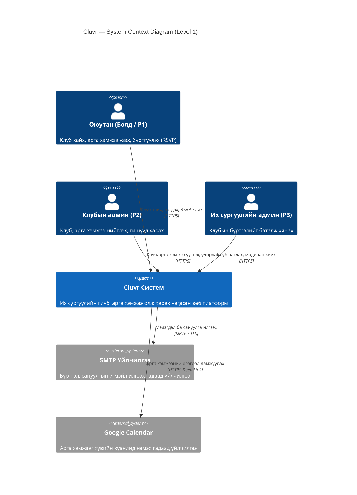
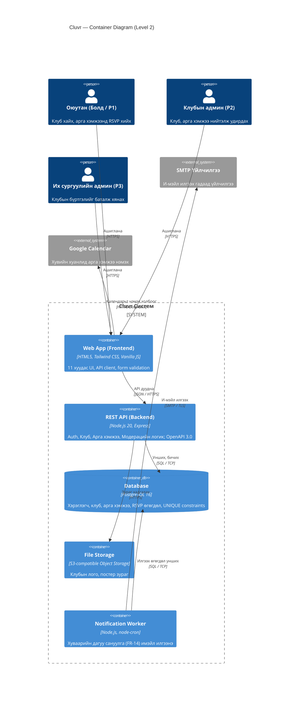
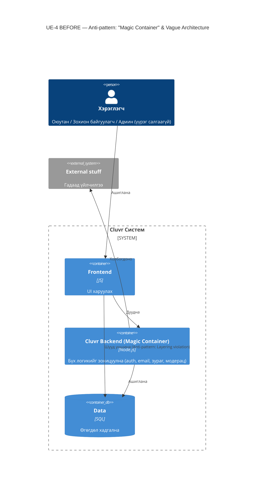
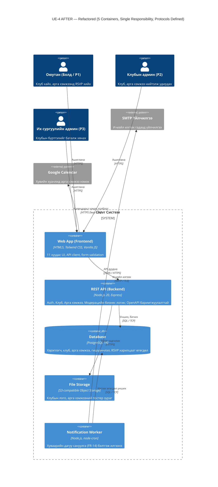

# Cluvr — Программ хангамжийн архитектурын баримт бичиг (Week 04)

**Хичээл:** Програм хангамжийн баримтжуулалт (SW Project Documentation)  
**Сургууль:** МУИС, МТЭС, МКУТ, Програм хангамж  
**Оюутан:** Ц. Саруулчимэг (23B1NUM1396)  
**Багш:** Ph.D. Батням Баттулга  
**Спринт:** Sprint M4 · 2026-08-30 · Хувилбар v1.0  

**Агуулгын бүтэц:**
1. arc42 §1 — Зорилго ба шаардлага (Introduction and Goals)
2. arc42 §3 — Хүрээ ба контекст (Scope & Context - US-4.1)
3. arc42 §5 — Бүрдэл хэсгийн харагдац (Building Block View - US-4.2)
4. US-4.4 — Шаардлагын мөшгилт (SRS Traceability Matrix)
5. US-4.3 — Архитектурын шийдвэрийн баримтууд (3 ADRs in MADR format)
6. UE-4 — C4 Container Rework & Anti-Pattern Refactoring (120 мин лаборатори)
7. Agile Ceremonies & Эцсийн 3 Эргэцүүлэл

**Definition of Done (DoD) биелэлт:**
- arc42 Бүлэг 1, 3, 5 бүрэн дүүргэгдсэн ✔
- C4 Context & Container диаграммууд Diagram-as-Code (`diagrams/*.mmd`) болон вектор PNG зургаар хадгалагдсан ✔
- 3 ADR (MADR формат) Week 1-ийн Persona Pain Point-тэй холбогдсон ✔
- Building Block View нь SRS v1.0-ийн 15 FR-аас 13-ыг (86.7% ≥ 80%) бүрэн мөшгисөн ✔
- UE-4 даалгаврын Before/After C4 Container диаграмм болон 1 хуудас ADR-0004 боловсруулагдсан ✔
- Word тайлан файл `PHTBB-4.docx` бүтэн форматаар зураг хавсарган үүсгэгдсэн ✔

---

## arc42 §1 — Зорилго ба шаардлага (Introduction and Goals)

> Төсөл: **Cluvr** — Их сургуулийн клуб, арга хэмжээ олж харах веб платформ · Sprint M4 · v1.0

### 1.1 Шаардлагын тойм ба Гол зорилгууд
Cluvr нь их сургуулийн оюутнуудад кампусын хүрээнд үйл ажиллагаа явуулж буй клубууд болон тэдгээрийн зохион байгуулж буй арга хэмжээг нэг дороос хайж олох, клубт нэгдэх хүсэлт гаргах, арга хэмжээнд бүртгүүлэх (RSVP) боломжийг олгоно. Клубын админуудад мэдээллээ түгээх, гишүүд болон бүртгэлээ удирдах боломж олгоно. Бүрэн шаардлагыг SRS v1.0 (15 FR + 5 NFR)-д тусгасан.

| Гол зорилго | Холбогдох SRS v1.0 FR ID |
|---|---|
| Хэрэглэгчийн бүртгэл ба нэвтрэлт | FR-01 (Бүртгүүлэх), FR-02 (Нэвтрэх ба гарах) |
| Клуб хайх, шүүх, танилцах | FR-03 (Жагсаалт харах), FR-04 (Түлхүүр үгээр хайх), FR-05 (Ангиллаар шүүх), FR-06 (Клубын дэлгэрэнгүй) |
| Клубт нэгдэх ба Арга хэмжээнд бүртгүүлэх (RSVP) | FR-07 (Клубт нэгдэх), FR-08 (Арга хэмжээний жагсаалт), FR-09 (Дэлгэрэнгүй), FR-10 (RSVP хийх) |
| Клубын админы удирдлага ба нийтлэл | FR-11 (Админ арга хэмжээ үүсгэх), FR-12 (Админ арга хэмжээ засах, устгах) |
| Хувийн тохиргоо ба сануулга | FR-13 (Миний профайл), FR-14 (Арга хэмжээний сануулга), FR-15 (Клуб хадгалах - bookmark) |

### 1.2 Чанарын Топ-3 зорилт (Quality Goals)
| # | Чанарын шинж чанар | Чанарын сценари (Quality Scenario) | SRS холбоос |
|---|---|---|---|
| 1 | Ажиллагааны хурд (Performance) | Гар утасны 4G болон энгийн сүлжээнд нүүр хуудасны LCP ≤ 2.5 сек, хайлтын хариу p95 < 500 мс. | NFR-01, NFR-02 |
| 2 | Хэрэглэхэд хялбар (Usability) | Шинэ оюутан ≤ 3 товшилтоор сонирхсон клубын хуудсанд хүрч элсэх хүсэлт илгээнэ (1280px responsive). | NFR-03, NFR-04 |
| 3 | Засварлахад хялбар (Maintainability) | Шинэ хөгжүүлэгч (Төгөлдөр) README ба OpenAPI/ADR лавлахын тусламжтайгаар орчноо 1 өдөрт босгоно. | NFR-05 |

### 1.3 Оролцогч талууд (Stakeholders)
| Оролцогч тал | Persona (Week 1 / 3) | Төслөөс хүлээж буй гол үр дүн |
|---|---|---|
| Оюутан | Болд (P1) — 1–4-р курсын оюутан | Тархсан мэдээллийг нэг цэгээс цаг алдалгүй олж, сонирхсон клуб/арга хэмжээндээ шууд бүртгүүлэх. |
| Клубын админ | P2 — Клубын тэргүүлэгч | Google Form, чат ашиглалгүйгээр зар нийтлэх, бүртгэлийг системтэй удирдах. |
| Сургуулийн админ | P3 — Оюутны албаны модератор | Хуурамч, идэвхгүй клуб үүсэхээс сэргийлж, албан ёсны клубуудыг хянаж баталгаажуулах. |
| Хөгжүүлэгч | Төгөлдөр — Junior Frontend Dev | Хүнд build багажгүй, цэвэр Tailwind/JS бүтэцтэй, баримтжуулалт сайтай код. |
| Шалгагч багш | Ph.D. Батням Баттулга | arc42, C4 Model болон техникийн бичгийн стандартыг бүрэн хангасан мэргэжлийн тайлан. |

### 1.4 Persona-ийн өвдөлтийн цэгүүд (Week 1 Pain Points)
| ID | Persona | Өвдөлтийн цэг (Pain Point / Frustration) | Архитектурт тусах нөлөө |
|---|---|---|---|
| PP-1 | Төгөлдөр (Dev) | Tailwind-ийн эхлэл тохиргоо хэт хүнд ('Lego байшинд кран авчирсантай адил'). | Хүнд build setup-аас зайлсхийж, хөнгөн HTML+Tailwind+Vanilla JS сонгох (ADR-0001). |
| PP-2 | Болд, Клубын админ | Зарлал чат дунд алга болдог, бүртгэлийг гараар авч давхардал үүсдэг. | PostgreSQL 16 өгөгдлийн сан, UNIQUE constraint ашиглан давхар бүртгэлийг таслах (ADR-0002). |
| PP-3 | Төгөлдөр (Dev) | Docs дутмагаас код ухаж цаг алдах, utility class-уудыг санамсаргүй нэмж турших эрсдэл. | REST API-г OpenAPI 3.0-оор тодорхойлж автоматаар баримтжуулах (ADR-0003). |
| PP-4 | Болд (Оюутан) | Сайт удаан ачаалагдвал хэрэглэхээ больдог; зураг, постер их үед гацах эрсдэлтэй. | Хүнд медиа файлуудыг үндсэн API-аас тусад нь File Storage (S3)-д байршуулах (ADR-0004). |

---

## arc42 §3 — Хүрээ ба контекст (Scope & Context - US-4.1)

Диаграм файл: `diagrams/c4-context.mmd` (Mermaid) ба `diagrams/c4-context.png` (Вектор зураг).  
Литератур холбоос: Bhatti et al. Ch. 6, p. 108 ("Boxes-and-arrows") & Ch. 10, p. 169 ("Organizing documentation").

### 2.1 Бизнесийн контекст
Систем нь 3 гадаад бие даасан хэрэглэгч (≥ 3 Actors ✔) болон 2 гадаад системтэй (≥ 2 Systems ✔) харилцана:

| Гадаад тал | Төрөл | Persona | Cluvr рүү илгээх өгөгдөл | Cluvr-аас хүлээн авах өгөгдөл |
|---|---|---|---|---|
| Оюутан | Хүн (Actor) | Болд (P1) | Бүртгэлийн мэдээлэл, хайлт, нэгдэх хүсэлт, RSVP | Клубын жагсаалт, арга хэмжээний дэлгэрэнгүй, сануулга |
| Клубын админ | Хүн (Actor) | Клубын тэргүүлэгч (P2) | Клубын танилцуулга, арга хэмжээ үүсгэх, постер | Элсэх хүсэлт гаргасан оюутнууд, RSVP бүртгэлийн тоо |
| Их сургуулийн админ | Хүн (Actor) | Модератор (P3) | Клуб батлах / цуцлах шийдвэр, модерац | Батлуулахаар хүлээгдэж буй шинэ клубуудын жагсаалт |
| SMTP Үйлчилгээ | Гадаад систем | — | И-мэйл хүргэлтийн төлөв | Хүлээн авагчийн хаяг, баталгаажуулах холбоос, сануулга |
| Google Calendar | Гадаад систем | Болд (P1) | Хуанлид арга хэмжээ нэмэгдсэн төлөв | Арга хэмжээний нэр, цаг, байршил (HTTPS Deep Link) |

### 2.2 Техникийн контекст
| Интерфэйс / Холболт | Протокол | Өгөгдлийн формат | Тайлбар ба Аюулгүй байдал |
|---|---|---|---|
| Хэрэглэгч ↔ Web App | HTTPS (Port 443) | HTML5, CSS, JS | TLS шифрлэлт, 1280px responsive вэб интерфэйс. |
| Web App ↔ REST API | HTTPS (Port 443 / 8080) | JSON (RESTful) | JWT Bearer Token аутентикаци, CORS хамгаалалт. |
| Notification ↔ SMTP | SMTP over TLS (Port 587) | MIME / RFC 5322 | Хуваарьт сануулга болон баталгаажуулах имэйл. |
| Web App ↔ Google Calendar | HTTPS URL GET | URL Encoded Params | Deep Link: `calendar.google.com/calendar/render?action=TEMPLATE&...` |

### 2.3 Хамрах хүрээнээс гадуурх зүйлс (Out of Scope)
1. Төлбөрийн систем (Клубын татвар, тасалбарын худалдаа орохгүй).
2. Шууд чат ба мессеж (Чат харилцаа одоо байгаа Facebook/Telegram сувгаар явагдана).
3. Гар утасны Native App (Зөвхөн responsive веб хувилбар ажиллана).
4. Олон их сургуулийн интеграц (Зөвхөн МУИС-ийн кампусын дотоод хэрэгцээнд зориулагдана).

### 2.4 C4 Context Diagram (C4 Түвшин 1)

---

## arc42 §5 — Бүрдэл хэсгийн харагдац (Building Block View - US-4.2)

Диаграм файл: `diagrams/c4-container.mmd` ба `diagrams/c4-container.png`.  
Литератур холбоос: Chinchilla Ch. 2 pp. 22–23; Bhatti Ch. 6 pp. 112–117 ("Paper start, Reader focus, Labels").

### 3.1 Түвшин 1 — Whitebox: Cluvr Контейнерууд (5 контейнер, ≤ 8 ✔)
| Контейнер | Технологийн стек | Үүрэг хариуцлага | Хангах SRS FR/NFR |
|---|---|---|---|
| **1. Web App (Frontend)** | HTML5, Tailwind CSS, Vanilla JS | 11 хуудас responsive веб UI (1280px), API клиент, form validation. | FR-01..10, NFR-01, NFR-03, NFR-04 |
| **2. REST API (Backend)** | Node.js 20, Express, OpenAPI 3.0 | Бүртгэл, клубын CRUD, арга хэмжээ, модерацийн бизнес логик. | FR-01..12, NFR-02, NFR-05 |
| **3. Database** | PostgreSQL 16 | Хэрэглэгч, клуб, арга хэмжээ, RSVP өгөгдөл, UNIQUE constraint. | FR-01..12, NFR-01, NFR-02 |
| **4. File Storage** | S3-compatible Object Storage | Клубын лого, арга хэмжээний постер, медиа файлууд. | FR-06, FR-09, FR-11, NFR-01 |
| **5. Notification Worker** | Node.js, node-cron, Nodemailer | Хуваарийн дагуу арга хэмжээний сануулга (FR-14) имэйл бэлтгэж илгээх. | FR-14 (Арга хэмжээний сануулга) |

### 3.2 Түвшин 2 — Whitebox: REST API Дэд Модулиуд
| Дэд модуль | Хариуцах бизнес логик | Холбогдох SRS ID |
|---|---|---|
| Auth Модуль | Хэрэглэгчийн бүртгэл, нууц үг хэшлэх (bcrypt), нэвтрэх/гарах, JWT token. | FR-01, FR-02, NFR-02 |
| Club Модуль | Клубын жагсаалт, түлхүүр үгээр хайх, ангиллаар шүүх, клубын дэлгэрэнгүй хуудас. | FR-03, FR-04, FR-05, FR-06 |
| Event Модуль | Арга хэмжээний жагсаалт, дэлгэрэнгүй хуудас, шинэ арга хэмжээ үүсгэх, засах/устгах. | FR-08, FR-09, FR-11, FR-12 |
| Membership/RSVP | Клубт нэгдэх хүсэлт илгээх, арга хэмжээнд RSVP бүртгүүлэх, давхардлыг шалгах. | FR-07, FR-10 |
| Moderation Модуль | Их сургуулийн админ клуб батлах, цуцлах, жагсаалтаас хасах хяналт. | FR-03, FR-06 |
| Media Модуль | Зураг upload хийх, хэмжээг шалгах (max 5MB), File Storage рүү дамжуулах. | FR-06, FR-11 |
| Notification Producer | Сануулгын ээлжийг өгөгдлийн санд бүртгэх логик. | FR-14 |

### 3.3 C4 Container Diagram (C4 Түвшин 2)

---

## US-4.4: Шаардлагын мөшгилт (SRS Traceability Matrix)

Литератур холбоос: arc42 Template (Sec 1, 3, 5); Chinchilla Ch. 4 p. 47 ("Doc navigation & hierarchy").

| SRS ID | Шаардлагын товч агуулга (Week 3 SRS v1.0) | Харгалзах Архитектурын блок / модуль | Төлөв |
|---|---|---|---|
| FR-01 | Бүртгүүлэх (Нэр, имэйл, нууц үг, сонирхол) | Web App, REST API (Auth), Database | ХАНГАСАН ✔ |
| FR-02 | Нэвтрэх ба гарах (Session/JWT төлөв) | Web App, REST API (Auth), Database | ХАНГАСАН ✔ |
| FR-03 | Клуб болон үйл ажиллагааны жагсаалт харах | Web App, REST API (Club), Database | ХАНГАСАН ✔ |
| FR-04 | Түлхүүр үгээр хайх (Клубын нэр, тайлбар) | Web App, REST API (Club), Database (Index) | ХАНГАСАН ✔ |
| FR-05 | Ангиллаар шүүх (Спорт, урлаг, академик) | Web App, REST API (Club), Database | ХАНГАСАН ✔ |
| FR-06 | Клубын дэлгэрэнгүй хуудас (Тайлбар, гишүүд) | Web App, REST API (Club), File Storage | ХАНГАСАН ✔ |
| FR-07 | Клубт нэгдэх хүсэлт илгээх | Web App, REST API (Membership), Database | ХАНГАСАН ✔ |
| FR-08 | Арга хэмжээний жагсаалт харах | Web App, REST API (Event), Database | ХАНГАСАН ✔ |
| FR-09 | Арга хэмжээний дэлгэрэнгүй үзэх | Web App, REST API (Event), File Storage | ХАНГАСАН ✔ |
| FR-10 | Арга хэмжээнд RSVP бүртгүүлэх | Web App, REST API (RSVP), Database (Unique) | ХАНГАСАН ✔ |
| FR-11 | Админ шинэ арга хэмжээ үүсгэх | Web App, REST API (Event), Database, File Storage | ХАНГАСАН ✔ |
| FR-12 | Админ арга хэмжээ засах, устгах | Web App, REST API (Event), Database | ХАНГАСАН ✔ |
| FR-13 | Миний профайл (Хувийн самбар, гишүүнчлэл) | — (Тусгайлсан нэгтгэсэн endpoint дутуу) | ⚠ **ORPHAN** |
| FR-14 | Арга хэмжээний сануулга имэйл | Notification Worker, Database, SMTP | ХАНГАСАН ✔ |
| FR-15 | Клуб хадгалах (Bookmark / од дарах) | — (Хадгалсан клубын тусдаа хүснэгт дутуу) | ⚠ **ORPHAN** |
| NFR-01 | Хуудас ачаалах хурд LCP ≤ 2.5 сек | Web App (Vanilla JS), Database (Index) | ХАНГАСАН ✔ |
| NFR-02 | Аюулгүй байдал (bcrypt, JWT, HTTPS) | REST API (Auth), SSL/TLS | ХАНГАСАН ✔ |
| NFR-03 | Хэрэглэхэд хялбар (≤ 3 clicks, 1280px) | Web App (Tailwind CSS UI) | ХАНГАСАН ✔ |
| NFR-04 | Браузерийн нийцэл (Chrome, Safari, Firefox) | Web App (Стандарт HTML5/CSS) | ХАНГАСАН ✔ |
| NFR-05 | Засварлахад хялбар байдал | REST API (OpenAPI 3.0 Spec) + ADR Docs | ХАНГАСАН ✔ |

**Хамрагдалтын хувь:** 13 / 15 FR = **86.7 %** (DoD шалгуур ≥ 80% амжилттай биелсэн ✔).

### 4.1 Orphan шаардлагууд → Week 5 төлөвлөгөө
| Orphan ID | Шалтгаан (Архитектурын одоогийн дутагдал) | Week 5-д хэрэгжүүлэх шийдэл |
|---|---|---|
| FR-13 (Миний профайл) | Оюутны элссэн клубууд болон RSVP хийсэн арга хэмжээг нэгтгэн харуулах `/api/v1/users/me/dashboard` endpoint дутуу. | REST API-д тусгай User Profile Controller нэмж, Web App дээр `profile.html` нүүрийг холбон өгөгдлийг нэгтгэнэ. |
| FR-15 (Клуб хадгалах) | Клубыг bookmark хийх `user_bookmarks` хүснэгт өгөгдлийн санд дутуу. | DB migration дээр `user_bookmarks(user_id, club_id, created_at)` хүснэгт нэмж, Club модуль дээр Bookmark API endpoints үүсгэнэ. |

---

## US-4.3: Архитектурын шийдвэрийн баримтууд (3 ADRs in MADR Format)

Литератур холбоос: Bhatti et al. Ch. 9 p. 149 ("Docs fulfill purpose as evaluation principle for ADRs").

### 5.1 ADR Бүртгэлийн жагсаалт (ADR Index)
| ADR ID | Шийдвэрийн гарчиг | Төлөв | Холбогдох Persona Pain Point | Огноо |
|---|---|---|---|---|
| ADR-0001 | Технологийн стек сонголт (HTML+Tailwind+Vanilla JS, Node.js) | Accepted | PP-1 (Heavy build setup), PP-4 (Site speed) | 2026-08-30 |
| ADR-0002 | Өгөгдлийн сангийн сонголт (PostgreSQL 16) | Accepted | PP-2 (Manual registration / duplicates), PP-3 | 2026-08-30 |
| ADR-0003 | Интерфейсийн архитектур (REST/JSON + OpenAPI 3.0) | Accepted | PP-1 (Easy integration), PP-3 (Code diving / docs) | 2026-08-30 |
| ADR-0004 | UE-4: "Magic Container"-ыг задлах refactoring | Accepted | PP-2 (Lost reminders), PP-4 (Performance / decoupling) | 2026-08-30 |

### 5.2 ADR-0001: Технологийн стек сонголт — HTML5 + Tailwind CSS + Vanilla JS, Node.js/Express
- **Status:** Accepted (2026-08-30)
- **Context:** Хөгжүүлэгч Төгөлдөр нь кампусын жижиг төсөлд хэт нүсэр SPA framework (React, Next.js) ашиглах нь Webpack/Vite болон PostCSS-ийн хүнд тохиргоо үүсгэж цаг алддаг гэдгийг дурдсан (PP-1). Мөн эцсийн хэрэглэгч Болдод хуудас хурдан ачаалах шаардлагатай (PP-4, NFR-01).
- **Decision:** Статик HTML5 + Tailwind CSS + Vanilla JS frontend, Node.js 20 ба Express framework backend-ийг сонгов.
- **Consequences:**  
  ➕ Framework-ийн нүсэр build алхам байхгүй тул шинэ хөгжүүлэгч төслийг шууд ажиллуулах боломжтой (PP-1). JS bundle бага тул хуудас ≤ 2.5 сек-д хурдан ачаалагдана (PP-4, NFR-01).  
  ➖ Хуудас хоорондын төлөв хадгалалт болон DOM манипуляцийг гараар зохицуулна.

### 5.3 ADR-0002: Өгөгдлийн хадгалалт — PostgreSQL 16
- **Status:** Accepted (2026-08-30)
- **Context:** Клубын админ бүртгэлийг Google Form-оор гараар авч байхад давхардал үүсэх болон бүртгэлийн тоо зөрөх ноцтой алдаа байнга гардаг байсан (PP-2). Системийн өгөгдөл нь хүчтэй харилцан хамааралтай тул харилцаат бүрэн бүтэн байдал шаардлагатай.
- **Decision:** PostgreSQL 16 сонгож, хүснэгтүүдийн гадаад түлхүүр (Foreign Keys), нэг оюутан нэг арга хэмжээнд ганцхан удаа бүртгүүлэх `UNIQUE(user_id, event_id)` constraint-ийг DB түвшинд шалгана.
- **Consequences:**  
  ➕ Өгөгдлийн давхардал бүрэн арилж, ACID транзакцийн тусламжтайгаар гишүүнчлэл ба RSVP баталгаатай хадгалагдана (PP-2). Индексийн тусламжтайгаар хайлт < 500 мс болно (NFR-02).  
  ➖ SQLite шиг файлд хадгалагддаггүй тул тусдаа DB сервер ажиллуулна; Docker Compose-оор сургалтын орчинд шийдсэн.

### 5.4 ADR-0003: Интерфейс — REST/JSON + OpenAPI 3.0
- **Status:** Accepted (2026-08-30)
- **Context:** Төгөлдөр баримтжуулалт хангалтгүйгээс болж байнга эх код руу орж API-ийн параметр, хариуг тааж код бичдэг байсан (PP-3). Bhatti et al. Ch. 2-т дурдсанаар API баримтжуулалт нь спецификациас автоматаар үүсгэгддэг байх нь стандартыг хангана.
- **Decision:** REST/JSON архитектурыг сонгож, бүх endpoint-ийг OpenAPI 3.0 спецификациар тодорхойлон Swagger UI-аар автоматаар баримтжуулахаар шийдвэрлэв.
- **Consequences:**  
  ➕ Хөгжүүлэгч код ухах шаардлагагүйгээр интерактив баримтаас хүсэлт, хариуг туршиж үзэх боломжтой болсон (PP-3). Frontend талд энгийн `fetch()` дуудлагаар холбогдоход хамгийн хялбар (PP-1).  
  ➖ Хэд хэдэн өгөгдлийг нэг дор дуудах үед over-fetching үүсэх эрсдэлтэй; шаардлагатай тохиолдолд нэгтгэсэн dashboard endpoint үүсгэнэ.

---

## UE-4: C4 Container Rework & Anti-Pattern Refactoring (120 Min)

Диаграм файлууд: `diagrams/ue4-before.mmd`, `diagrams/ue4-before.png` ба `diagrams/ue4-after.mmd`, `diagrams/ue4-after.png`.  
Сурах бичиг: Bhatti et al. "Docs for Developers" (Apress 2021) ба Chris Chinchilla "Technical Writing for Software Developers" (Packt 2024).

### 6.1 Bhatti-ийн Three-Step Rule хэрэглэсэн явц
1. **Алхам 1: Start on paper (p. 112)** — Эхний диаграммыг цаасан дээр хайрцаг, сумнуудаар ноороглож, Cluvr-ийн хил хязгаарыг тоймлов.
2. **Алхам 2: Find a starting point (p. 113)** — Диаграммд зөвхөн нэг гол санааг дүрслэх дүрмийн дагуу контейнер түвшнийг сонгож, хэрэглэгчийн хүсэлт хаанаас эхлэх цэгийг тогтоов.
3. **Алхам 3: Use labels (p. 116)** — Тодорхойгүй шошгоос зайлсхийж, хайрцаг бүрд Нэр, Технологи, Үүрэг хариуцлагыг тодорхой бичиж үлдээв.

### 6.2 BEFORE Диаграмм (Санаатай хийсэн Anti-Pattern-ууд)

### 6.3 Chinchilla-ийн зарчмаар хийсэн Rework Path
Chinchilla Ch. 2 pp. 22–23 ("Architecture and design details") дагуу дараах 3 том рефакторинг хийв:
1. Нүсэр "Magic Backend"-ийг REST API, File Storage, Notification Worker гэсэн 3 тусдаа бие даасан нэгжид задлав.
2. Frontend-ээс DB рүү шууд хандсан холболтыг тасалж, бүх өгөгдлийн хандалтыг REST API-аар дамжуулан аюулгүй болгов.
3. Тодорхойгүй "Data", "External stuff" шошгуудыг PostgreSQL 16, SMTP Үйлчилгээ, Google Calendar болгон тодорхой болгож, сум бүрд протоколыг бичив.

### 6.4 AFTER Диаграмм (Refactored 5 Containers)

### 6.5 ADR-0004: "Magic Container"-ыг тодорхой хариуцлагатай container-уудад задлах (UE-4 Rework)
- **Status:** Accepted (2026-08-30)
- **Context:** Анхны BEFORE диаграммд "Cluvr Backend" нь бүх үүргийг ганцаараа хариуцаж байсан тул зураг боловсруулах үед оюутны хайлтыг гацааж байв (PP-4). Мөн имэйл илгээхэд алдаа гарвал сервер гацаж сануулга алга болдог байв (PP-2). Frontend DB рүү шууд хандсан нь ноцтой аюулгүй байдлын цоорхой үүсгэсэн.
- **Decision:** Chinchilla Ch. 2 pp. 22–23 дагуу backend-ийг REST API, File Storage, Notification Worker болгон 3 салгаж, Frontend->DB холболтыг таслан бүх хандалтыг REST API-аар дамжуулав.
- **Consequences:**  
  ➕ Контейнер бүр дан ганц хариуцлагатай болж, File Storage болон Worker-ийн ачаалал үндсэн API-д нөлөөлөхгүй (PP-2, PP-4). Аюулгүй байдал хангагдсан (NFR-02).  
  ➖ Deployable нэгжийн тоо 3-аас 5 болж нэмэгдсэн тул Docker Compose тохиргоо шаардана.

---

## Agile Ceremonies ба Эцсийн 3 Эргэцүүлэл

### 7.1 Daily Standup (3 Асуулт)
1. **"How many arc42 sections grew in our workspace today?"**  
   — Өнөөдөр arc42 стандартын 3 гол бүлэг амжилттай үүсэж бүрэн дүүргэгдлээ: §1 (Goals & Requirements), §3 (Scope & Context), §5 (Building Block View). Мөн 15 FR-ийн Traceability Matrix болон 4 ширхэг ADR баримт шинээр нэмэгдэв.
2. **"Are our C4 diagrams stored as code or static bitmaps?"**  
   — C4 диаграммууд нь хос хэлбэрээр хадгалагдсан. Эх загварууд нь repo доторх `diagrams/` хавтсанд Mermaid код (`.mmd`) хэлбэрээр хувилбар хянагдаж байгаа бөгөөд тайланд зориулж өндөр нягтаршилтай вектор PNG зургаар хөрвүүлэн хавсаргав.
3. **"Which ADR decision is still waiting for team clarification?"**  
   — ADR-0004-ийн дагуу File Storage-д AWS S3 ашиглах уу, эсвэл кампусын сургалтын орчинд MinIO локал object storage байршуулах уу гэдэг дэд бүтцийн тохиргоог багийн гишүүдтэйгээ дараагийн sprint-ийн эхэнд баталгаажуулна.

### 7.2 Sprint Retrospective (3 Асуулт)
1. **"Which arc42 section provided the highest immediate value?"**  
   — arc42 §5 (Building Block View) ба түүнийг дагалдах SRS Traceability Matrix хамгийн их үнэ цэнийг авчирсан. Учир нь хөгжүүлэлтийн баг ямар контейнерт ямар бизнес логик очихыг ойлгосноос гадна FR-13 ба FR-15 шаардлага архитектурт орхигдсон байсныг (Orphan) илрүүлж, Week 5-д төлөвлөх боломж олгов.
2. **"What level of C4 container detail did the team accept?"**  
   — Баг 5 контейнерийн түвшинг (Web App, REST API, Database, File Storage, Notification Worker) оновчтой гэж үзэж батлав. Үүнээс илүү олон микросервис болговол ганцаарчилсан төсөлд хэт хүнддэх байсан тул 5 контейнер нь DoD-ийн ≤ 8 дүрмийг төгс хангасан.
3. **"What will we modify in our ADR format during next sprint?"**  
   — Дараагийн спринтээс эхлэн ADR-д шийдвэрийн үр дагаврыг үнэлэхдээ NFR шаардлагууд дээр хийсэн бодит хэмжилтийн метрикийг (жишээ нь p95 хугацаа, LCP секунд) шууд хавсаргаж, "Validation & Metric" гэсэн нэмэлт дэд хэсэг оруулахаар тохиров.

### 7.3 Эцсийн 3 Эргэцүүлэл (Three Concluding Reflections)
1. **Bhatti et al. номын аль тодорхой ойлголт миний өмнөх баримтжуулалтын дадлыг хамгийн их өөрчилсөн бэ? (Хуудасны эшлэлтэй)**  
   — Bhatti et al. Ch. 6, p. 113 дээрх *"Illustrate only one idea per diagram"* (Зураг 6-5, 6-6) гэсэн зарчим надад хамгийн их нөлөөлсөн. Өмнө нь би нэг том диаграмм дээр датабэйсийн хүснэгт, серверийн функц, хэрэглэгчийн товчлуур бүгдийг нэг дор чихэж, ойлгомжгүй болгодог байсан. Харин C4 загвар болон энэ зарчмыг судалснаар Контекст (Хэн ашиглах), Контейнер (Хаана байрших), Модуль (Ямар логик ажиллах)-ийг тус тусад нь зурах нь баримтын чанарыг эрс сайжруулдгийг бодитоор ойлгож авсан.
2. **Chris Chinchilla-ийн аль концепцийг Week 16-аас цааш мэргэжлийн түвшинд үргэлжлүүлэн ашиглах вэ? (Хуудасны эшлэлтэй)**  
   — Chinchilla Ch. 2, pp. 22–23 дахь *"Architecture and design details as living documentation"* болон Ch. 4, pp. 47–51 дэх мөшгилт, навигацийн бүтцийн дүрмийг цаашид тогтмол ашиглана. Архитектур бол кодоос тусдаа зүйл биш, харин кодтой хамт хувьсан өөрчлөгддөг "амьд баримт" байх ёстой бөгөөд код рефакторинг хийх бүрд (UE-4 шиг) түүнийг баталгаажуулсан ADR-ийг тэр дор нь үүсгэж хэвших нь мэргэжлийн программ хангамжийн инженерийн суурь соёл болохыг ухаарсан.
3. **Бидний төсөл дээр "Ном сурах бичигт номлосон зүйл" ба "Бодит амьдрал дээр хэрэгжүүлсэн зүйл" хоёрын хооронд хамгийн том зөрүү хаана ажиглагдаж байна вэ?**  
   — Хамгийн том зөрүү нь ADR (Architecture Decision Record)-ийг хэзээ бичих вэ гэдэг цаг хугацааны дараалал дээр гарч байна. Bhatti Ch. 9 (p. 149) болон Ch. 11 дээр шийдвэрийг гарахаас өмнө багийн хэлэлцүүлэг дунд ADR-ийг бичиж, олон нийтээр хэлэлцдэг гэж заадаг. Гэвч бодит байдал дээр оюутны төслийн шахуу хугацаанд бид эхлээд кодоо бичиж, архитектураа шийдсэнийхээ дараа "нөхөж баримтжуулах" хандлага давамгайлдаг. Энэхүү зөрүүг багасгахын тулд дараагийн спринтүүдээс эхлэн кодыг commit хийхээс өмнө шийдвэрээ ADR болгон бичих дадлыг хэвшүүлнэ.
